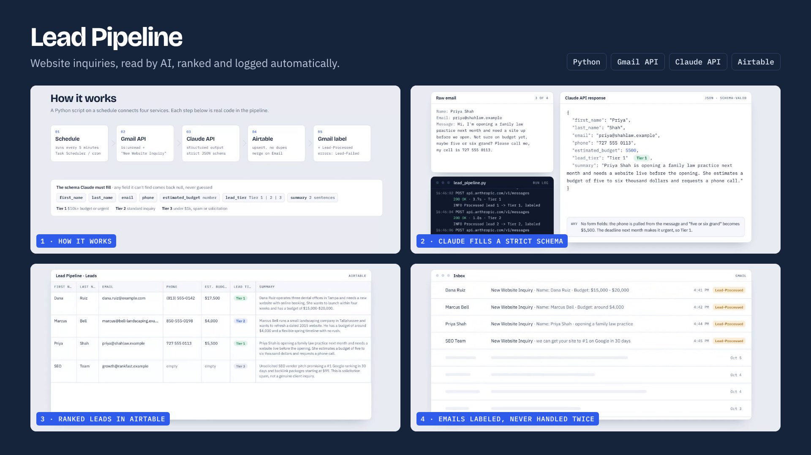

# Lead Pipeline

Website inquiries, read by AI, ranked and logged automatically.



Small businesses often handle web inquiries by hand: open each email, copy the details into a spreadsheet, and reply hours later. This Python pipeline does that work on its own. It checks a Gmail inbox every few minutes, has Claude extract each lead's details into a strict schema, ranks it by priority, saves it to Airtable without duplicates, and labels the email so it is never handled twice.

**Demo:** [interactive walkthrough](https://evannwilsonn.github.io/lead-ingestion-pipeline/demo.html) · [one-minute video](docs/demo.mp4) · [project site](https://evannwilsonn.github.io/lead-ingestion-pipeline/)

## How it works

| Step | What happens | Where in the code |
|---|---|---|
| 1. Schedule | Runs every 5 minutes (Windows Task Scheduler or cron) | `run_pipeline.bat` / `run_pipeline.sh` |
| 2. Gmail API | Finds unread emails matching `subject:"New Website Inquiry"` | `find_candidate_ids()` |
| 3. Claude API | Returns JSON that must match a strict schema (structured outputs); missing fields come back `null`, never guessed | `parse_lead()`, `LEAD_SCHEMA` |
| 4. Airtable | Upserts the lead, merging on Email (or Gmail message ID) so reruns never duplicate | `AirtableClient.upsert()` |
| 5. Gmail label | Marks the email read and adds `Lead-Processed`; unreadable emails get `Lead-Failed` for review | `process_message()` |
| Optional | Texts the team about Tier 1 leads via Twilio | `TwilioClient` |

**Tiers:** Tier 1 = $10k+ budget or urgent · Tier 2 = standard inquiry · Tier 3 = under $1k, spam or solicitation (the $10k cutoff is configurable).

## Example results

Real Claude responses from a test run on Oct 8, 2026 (each call took 1.8–3.7 seconds):

| Inquiry | Budget extracted | Tier | Why |
|---|---|---|---|
| Three dental offices, booking site, launch in 4 weeks | $17,500 (midpoint of $15k–$20k) | Tier 1 | Over $10k with a deadline |
| Landscaping company, site refresh, "no rush" | $4,000 | Tier 2 | Real project, moderate budget |
| New law practice, no form fields, "maybe five or six grand?" | $5,500 | Tier 1 | Opening next month makes it urgent; phone pulled from the message text |
| SEO agency spam pitch | null | Tier 3 | Solicitation; phone and budget left null instead of invented |

## Error handling

- **Temporary failures** (network drops, rate limits, outages) retry with backoff; if still failing, the email stays unread for the next run.
- **Bad emails** get the `Lead-Failed` label and are skipped on future runs.
- **Config or auth problems** stop the run with exit code 2 and a `CRITICAL` log line.
- Credentials live only in `.env`, `token.json` and `client_secret.json`, all gitignored.

**Stack:** Python · Gmail API (OAuth 2.0) · Anthropic Claude API · Airtable REST API · Twilio (optional)

---

# Setup

## 1. Google Cloud Console (Gmail API credentials)

1. Go to https://console.cloud.google.com and create a new project (e.g. `lead-pipeline`).
2. **APIs & Services → Library**, search **Gmail API**, click **Enable**.
3. **Google Auth Platform → Branding**: set an app name and support email.
4. **Audience**:
   - Google Workspace account: choose **Internal**. No verification needed and tokens don't expire.
   - Personal Gmail: choose **External**, add your Gmail address under **Test users**, then click **Publish app** to move it to *In production*. Apps left in *Testing* get refresh tokens that expire after 7 days, which would silently break the cron job. You'll see an "unverified app" warning during sign-in; click *Advanced → Go to app* (fine for your own account).
5. **Data Access → Add or remove scopes**: add `https://www.googleapis.com/auth/gmail.modify` (needed to read mail, mark it read, and apply labels).
6. **Clients → Create client → Desktop app**. Download the JSON and save it as `client_secret.json`.
7. On your laptop (needs a browser):
   ```bash
   python3 -m venv venv && source venv/bin/activate
   pip install -r requirements.txt
   export GMAIL_CLIENT_SECRET_FILE=./client_secret.json GMAIL_TOKEN_FILE=./token.json
   python lead_pipeline.py --authorize
   ```
   Approve access in the browser. This writes `token.json` (contains a refresh token — treat it like a password).

## 2. Airtable

Create a table (e.g. `Leads`) with these exact field names. They are case-sensitive and must match character for character, or every write fails and the email gets the `Lead-Failed` label:

| Field | Type |
|---|---|
| First Name | Single line text |
| Last Name | Single line text |
| Email | Email |
| Phone | Phone number |
| Estimated Budget | Currency |
| Lead Tier | Single select (Tier 1, Tier 2, Tier 3) |
| Summary | Long text |
| Gmail Message ID | Single line text |
| Received At | Date (include time) |

Create a personal access token at https://airtable.com/create/tokens with scopes `data.records:read` and `data.records:write`, and grant it access to this base. The base ID is the `app...` segment of the base URL.

Upserts merge on **Email** (a repeat inquiry updates the existing row with the latest summary/tier) or, if no email was found, on **Gmail Message ID** so reruns never duplicate.

## 3. Anthropic

Create an API key at https://console.anthropic.com. Override the model with `CLAUDE_MODEL` if needed.

## 4. Twilio Tier 1 alerts (optional)

1. Sign up at https://www.twilio.com and buy a phone number with SMS (a few dollars a month).
2. US numbers must be registered for A2P 10DLC (Messaging → Regulatory Compliance) before Twilio will deliver texts to US phones; this approval can take a few days. On a trial account you can only text numbers you've verified.
3. From the Twilio Console, copy the Account SID and Auth Token into `.env`, along with your Twilio number as `TWILIO_FROM_NUMBER` and the team's cell numbers as `ALERT_TO_NUMBERS`.

When those are set, every Tier 1 lead triggers a text like:

```
TIER 1 LEAD: Dana Ruiz | Budget: $25,000 | (813) 555-0142
Needs a booking site for three clinics. Wants launch in four weeks.
```

The text is sent after the lead is saved and the email is marked processed, so a rerun never double-texts, and a failed text never blocks the lead from reaching Airtable. Leave the Twilio variables blank to turn alerts off.

## Windows: test on your own PC

Good for testing. It only runs while the PC is on and awake, so use a server (next section) for clients.

In PowerShell, inside the project folder:

```powershell
python -m venv venv
venv\Scripts\pip install -r requirements.txt
copy .env.example .env        # then fill in your keys in Notepad
.\run_pipeline.bat --authorize    # one-time Gmail sign-in (needs client_secret.json in this folder)
.\run_pipeline.bat --dry-run      # prints parsed leads, writes nothing
.\run_pipeline.bat                # one real run; output goes to logs\pipeline.log
```

Schedule it every 5 minutes with no console window popping up (runs while you're signed in; replace the folder path with yours):

```powershell
$dir = "C:\Users\YOU\Downloads\lead-pipeline"
$action  = New-ScheduledTaskAction -Execute "$dir\venv\Scripts\pythonw.exe" -Argument "`"$dir\lead_pipeline.py`"" -WorkingDirectory $dir
$trigger = New-ScheduledTaskTrigger -Once -At (Get-Date) -RepetitionInterval (New-TimeSpan -Minutes 5)
$settings = New-ScheduledTaskSettingsSet -MultipleInstances IgnoreNew -StartWhenAvailable -AllowStartIfOnBatteries -DontStopIfGoingOnBatteries
Register-ScheduledTask -TaskName "Lead Pipeline" -Action $action -Trigger $trigger -Settings $settings
```

`pythonw.exe` runs without a window and the script logs to `logs\pipeline.log`. `IgnoreNew` skips a run if the previous one is still going (the Windows version of `flock`). To check on it: `Get-Content logs\pipeline.log -Tail 20`. To pause it: `Disable-ScheduledTask "Lead Pipeline"`; to remove it: `Unregister-ScheduledTask "Lead Pipeline"`.

## 5. Deploy to a cloud server (Ubuntu example)

```bash
sudo useradd --system --create-home --home-dir /opt/lead-pipeline leadbot
sudo -u leadbot -i
cd /opt/lead-pipeline
# copy lead_pipeline.py, requirements.txt, run_pipeline.sh, .env.example here
python3 -m venv venv && ./venv/bin/pip install -r requirements.txt
mkdir -p secrets && chmod 700 secrets
cp .env.example .env && chmod 600 .env   # fill in values
chmod +x run_pipeline.sh
```

From your laptop, copy the token up and lock it down:

```bash
scp token.json you@server:/tmp/ && ssh you@server \
  'sudo mv /tmp/token.json /opt/lead-pipeline/secrets/ && sudo chown leadbot: /opt/lead-pipeline/secrets/token.json && sudo chmod 600 /opt/lead-pipeline/secrets/token.json'
```

Test before scheduling (prints parsed JSON, writes nothing):

```bash
./run_pipeline.sh --dry-run
./run_pipeline.sh            # one real run
```

## 6. Schedule with cron

```bash
sudo mkdir -p /var/log/lead-pipeline && sudo chown leadbot: /var/log/lead-pipeline
sudo -u leadbot crontab -e
```

Add (runs every minute):

```
* * * * * /opt/lead-pipeline/run_pipeline.sh >> /var/log/lead-pipeline/run.log 2>&1
```

New leads reach Airtable, and Tier 1 texts go out, within about one to two minutes. Running every minute is safe: an empty inbox check takes a second and uses a tiny slice of Gmail's quota, and `flock` in the wrapper skips a run if the previous one is still going. Use `*/5 * * * *` instead if a five-minute delay is fine. Rotate logs with `/etc/logrotate.d/lead-pipeline`:

```
/var/log/lead-pipeline/*.log {
    weekly
    rotate 8
    compress
    missingok
    notifempty
    copytruncate
}
```

(A systemd timer works equally well if you prefer `journalctl` logging.)

## Troubleshooting failures

- **Transient** (network drops, 429s, 5xx, Claude overloaded): retried with backoff inside the run; if still failing, the email is left unread and picked up next run. Three in a row aborts the run early.
- **Permanent** (empty body, Airtable schema mismatch, unparseable output): email gets the `Lead-Failed` label and stays unread for manual review; it's excluded from future searches. Remove the label to retry.
- **Fatal** (bad/missing keys, revoked Gmail token, wrong base ID): run exits with code 2. Watch for `CRITICAL` in the log; a revoked token means re-running `--authorize`.
- Missing lead fields are stored as blank rather than guessed, and are never written over existing Airtable values.

For stricter secret handling, inject the same env vars from your cloud's secret manager (AWS Secrets Manager, GCP Secret Manager) instead of a `.env` file.
